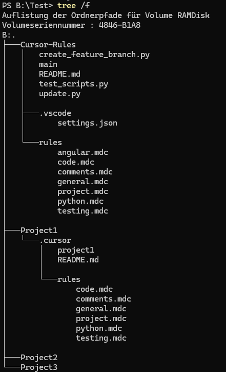

# Cursor Rules Sync

> **Short project description.**  
> A method to centralize cursor rules via Git, while allowing flexible per-project customization.

---

## Table of Contents

- [Motivation](#motivation)
- [Key Features](#key-features)
- [Prerequisites](#prerequisites)
- [Getting Started](#getting-started)
- [Usage](#usage)
  - [Creating a Feature Branch](#creating-a-feature-branch)
  - [Using This Repository as a Submodule](#using-this-repository-as-a-submodule)
- [Script Customization](#script-customization)
- [Testing](#testing)
- [Why Not OneDrive?](#why-not-onedrive)
- [Additional Information](#additional-information)
- [Disclaimer](#disclaimer)
- [Contact](#contact)

---

## Motivation

Maintaining a centralized set of **rules** across multiple projects can be challenging, especially when individual projects require slight customizations. This repository aims to:

1. Keep a **master set of rules** (`main` branch) that apply broadly.  
2. Allow **feature branches** for each project so they can remove unnecessary rules or introduce new ones (e.g., in `project.mdc` or newly added `.mdc` files).  
3. Provide **Python scripts** that make it easy to:
   - Create new branches with minimal overhead.
   - Propagate changes from `main` to all feature branches (excluding certain project-specific files like `project.mdc`).

---

## Key Features

- **Centralized Rule Management**: Store all rules in one place, easily synced across projects.
- **Branch-Based Customizations**: Each project’s specialized rules or removals live in its own feature branch.
- **Python Automation**:
  - `create_feature_branch.py`: Helps you create and configure a new feature branch.
  - `update.py`: Propagates changes from `main` (or another branch) to target branches, keeping them in sync.
- **Easy Setup via Git Submodules**: Integrate this repository directly into other repositories under a folder such as `.cursor`.

---

## Prerequisites

1. **Git** installed and working from the command line (including the ability to push/pull to GitHub, e.g., via SSH keys).
2. **Python** (version 3 or higher) installed and callable via `python` (or `python3`) on your command line.
3. (_Optional but recommended_) **pytest** installed for running automated tests:
   ```bash
   pip install pytest
   ```
4. A [GitHub](https://github.com/) account with proper permissions to create repositories and push branches.

---

## Getting Started

Below is a general workflow for setting up and using this repository in your projects:

1. **Create a new GitHub repository** by using this repository as a template.  
   This will be your independent repository where you add your rules for sharing across projects.
   

2. **Clone** that new repository locally:
   ```bash
   git clone https://github.com/<YourUser>/<YourNewRepo>.git
   cd <YourNewRepo>
   ```
   This repository should be used to maintain the rules, create feature branches, and propagate changes.

    2.1. **Create a feature branch** for your project using the provided script (see [Usage](#usage)):
   ```bash
   python create_feature_branch.py "FeatureBranchName"
   ```

    2.2. **Remove any rule sets** (e.g., `.mdc` files) that do not apply to the branch / related project.

    2.3. **Add project-specific rules** to `project.mdc` or additional `.mdc` files as needed.

    2.4. **Commit and push** your changes to the remote repository from Step 1.

3. In your **actual project folder**, **add this maintenance repository** as a **submodule**, specifying the desired branch (assuming the project uses git as well):
   ```bash
   # Using HTTPS:
   git submodule add -b <FeatureBranchName> https://github.com/<YourUser>/<YourNewRepo>.git .cursor
   # Or using SSH:
   git submodule add -b <FeatureBranchName> git@github.com:<YourUser>/<YourNewRepo>.git .cursor
   ```
   - This creates a `.cursor` folder that references the Cursor-Rules repository.

4. **Commit** the submodule reference in your project repository, and push your changes:
   ```bash
   git commit -m "Add Cursor-Rules submodule"
   git push
   ```

5. Example:

   


---

## Usage

### Creating a Feature Branch

If you need a custom set of rules for a given project (or environment), run:

```bash
python create_feature_branch.py "<FeatureBranchName>"
```

- This script will:
  1. Create and switch to a new local branch.
  2. Rename the `main` file to match your branch name.
  3. Optionally remove excluded files or folders (like `.vscode` or the Python scripts themselves).
  4. Commit these changes and push them upstream.

- **Branch Name Sanitation**: Spaces, special characters, or repeated slashes will be replaced or removed. You will be prompted to confirm if the script modifies your branch name.

### Using This Repository as a Submodule

- In your main project, point `.cursor` to your **specific** feature branch:
  ```bash
  cd .cursor
  git checkout <FeatureBranchName>
  # For any project-specific changes, commit them to <FeatureBranchName>.
  ```
- If certain rules are **not** needed, remove them in that branch.  
- If you need additional rules, create a new file rather than modifying existing ones (except project.mdc).

---

## Script Customization

Both `create_feature_branch.py` and `update.py` contain lists that define which files or directories are:
- **Included** in the synchronization or updates (e.g., `FILES_TO_UPDATE`).
- **Excluded** or removed during branch creation (e.g., `EXCLUDED_PATHS`).

You can edit these lists within the scripts themselves to align with your project’s requirements. For example:
- **`create_feature_branch.py`** often has a list of paths to remove when creating a new branch (like `.vscode` or specific Python files).
- **`update.py`** has a list of files (such as `README.md`, `rules/general.mdc`, etc.) to propagate across branches.

Adjust these to fine-tune the automation to your own setup.

---

## Testing

We use **pytest** for automated testing. A typical command:
```bash
pytest -v test_scripts.py
```
- This runs the tests for the Python scripts (`create_feature_branch.py` and `update.py`), ensuring branch creation and propagation work as expected.
- Linux uses `/tmp/` and Windows `B:/` as test directory - please adapt test_scripts.py if needed

---

## Why Not OneDrive?

Some users may wonder why we don’t simply store these rules on OneDrive. A key reason is:
- **Link Reliability**: OneDrive links can break or change during updates or re-syncing events, leading to broken references.
- **Git Submodule Advantages**: Version control is more robust and transparent. You can track changes, revert if needed, and keep a clear history of modifications.

---

## Additional Information

- This repository does not contain any rules by default. Please refer to other sources for customizing your rule sets
- This project does not rely on the monolithic `.cursorrules` file. Please refer to the [Cursor Documentation](https://docs.cursor.com/context/rules-for-ai).

---

## Disclaimer

- **Mac Testing**: Tests for macOS have not been conducted in this repository. Please proceed at your own discretion if you’re on macOS.

---
